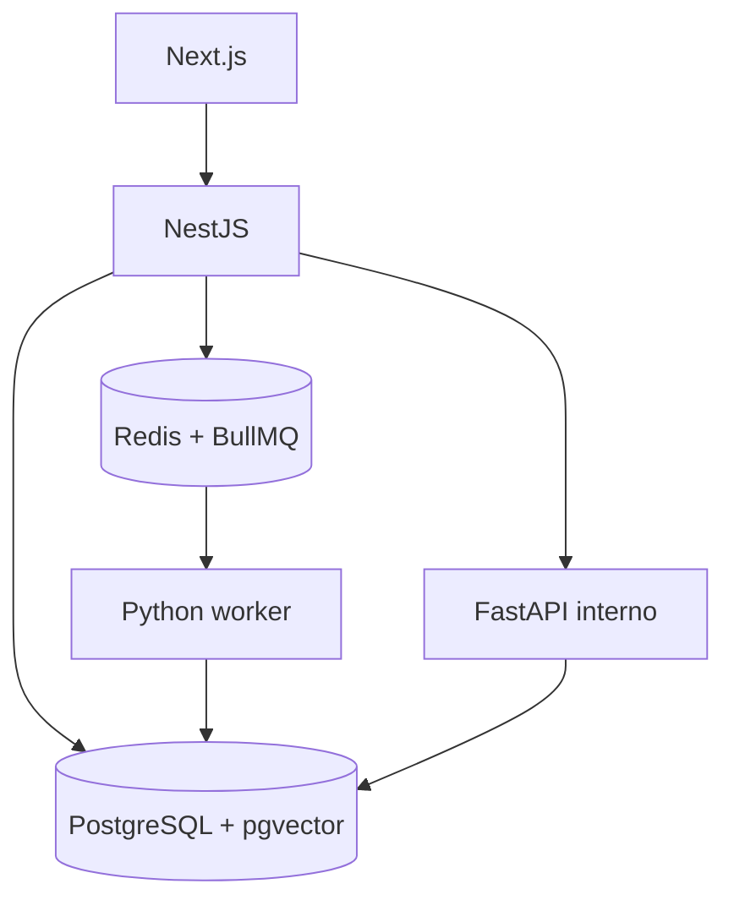

# Arquitetura e contratos

## Fluxo do primeiro corte



1. API autentica o usuario, confirma membership e papel no tenant e grava uma importacao pendente.
2. API publica job pequeno em BullMQ: IDs, versao do contrato e chave de idempotencia. Nunca colocar CSV completo, JWT ou segredo na fila.
3. Nesta primeira fatia, o worker Python valida o payload, resolve o lote persistido e grava documentos. Extracao estruturada entra no Marco 2.
4. Transacoes curtas gravam o documento com tenant_id. A chave (tenant, source, external_key) impede duplicatas no retry. Insights e embeddings entram com extracao avaliada no Marco 2.
5. Web consulta agregados pela API. A resposta apresenta contagem, janela temporal e referencias para documentos.
6. Futuro RAG: API autoriza; FastAPI recebe tenant validado e pergunta; busca documentos do tenant e modelo de embedding compativel; responde com citacoes ou insuficiencia de dados.

## Limites de responsabilidade

Web nunca acessa Redis/Postgres diretamente. NestJS e o plano de controle e dono das regras de usuario, assinatura e produto. Python processa dados e IA, mas revalida tenant e fonte contra o banco; nao confia cegamente em campos de um job. FastAPI e interno, autenticado entre servicos; o cliente chama apenas NestJS.

Agendamento continuo entra apos a primeira importacao manual. Use Job Schedulers do BullMQ para produzir jobs; registre o status de cada execucao no banco. Retries com backoff exponencial e limite; erros permanentes, como formato invalido ou fonte proibida, falham sem retry. O banco e a fonte de verdade do estado de importacao.

## Contrato de fila

Arquivo canonico: `packages/contracts/ingest-review-job.v1.schema.json`. Validar o mesmo JSON em TypeScript e Python. Campos:

```json
{
  "version": 1,
  "tenant_id": "b522d3cb-556c-46f3-bca3-a4d9a3a75e69",
  "import_id": "e8f28408-d57b-4839-989b-f519550c8e0d",
  "source_id": "79d47c62-9f2e-4dd6-97db-abdbbbfd7660",
  "idempotency_key": "import:e8f28408-d57b-4839-989b-f519550c8e0d:v1"
}
```

O job_id pode ser derivado da chave de idempotencia. O banco ainda precisa de restricoes unicas e upsert, pois processamento de filas pode repetir. Um teste de integracao deve produzir um job em NestJS/TypeScript e consumi-lo no BullMQ Python usando a mesma versao de contrato.

## API inicial proposta

| Metodo/rota | Resultado |
| --- | --- |
| POST /v1/tenants | Provisiona tenant e owner por fluxo autenticado |
| POST /v1/products | Cadastra produto proprio ou concorrente |
| GET /v1/products | Lista produtos do tenant |
| POST /v1/sources | Registra origem de dados |
| POST /v1/imports/reviews | Cria importacao e job |
| GET /v1/imports/:id | Retorna estado, falhas e contagens |
| GET /v1/insights/summary | Contagens por categoria/periodo/produto |
| GET /v1/documents/:id | Texto, origem e insight |
| POST /v1/questions | Fase RAG, com evidencias |

O tenant nao e escolhido por um header arbitrario. A API resolve o tenant ativo por sessao/JWT e membership; cada recurso consultado pertence a ele.

## Observabilidade minima

Log estruturado com tenant_id, import_id, job_id e correlation_id, sem texto integral da avaliacao nem segredos. Contadores de importacao, falha por origem, custo de LLM, latencia e volume de duplicatas. Registrar versao do prompt/modelo em cada extracao.
